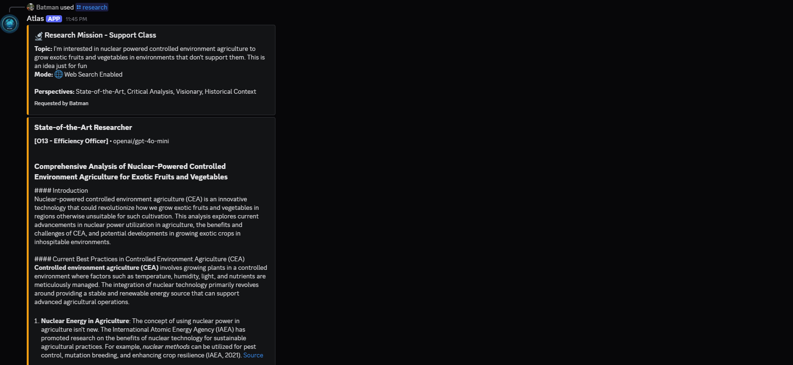

# Atlas War Room

A Discord-based AI council system where multiple LLM officers collaborate to strategize, brainstorm, and evaluate ideas.

## Overview

The War Room is the first phase of Atlas - a command center that brings together AI officers with different specialties to provide diverse perspectives on projects and challenges.

### The Council

The War Room consists of **16 AI officers** organized into 4 capability classes:

- **Strategic (O1-O4)** - High-level planning and executive decisions
- **Operational (O5-O8)** - Tactical execution and operations management
- **Tactical (O9-O12)** - Ground-level implementation and rapid response
- **Support (O13-O16)** - Infrastructure, budget, and logistics

Each officer uses a different LLM model (Claude, GPT, Gemini, Grok, DeepSeek, etc.) and has a specialized role and system prompt.

## Features

### `/mission` Command

Submit a mission brief to the council. Officers respond in parallel with their specialized perspectives.

**Options:**
- Filter by capability class (Strategic, Operational, Tactical, Support)
- All officers or specific class only

### `/research` Command

Conduct multi-perspective research with 4 officers taking distinct analytical roles:

- **State-of-the-Art Researcher** - Current best practices and leading solutions
- **Critical Analyst** - Counterexamples, flaws, limitations, and risks
- **Optimistic Visionary** - Futuristic possibilities and emerging tech (3-5 years ahead)
- **Historical Context Provider** - Evolution, past attempts, and lessons learned

**Options:**
- `use_web_search` - Enable real-time web search for supported models (Perplexity, Google Gemini)
- Capability class selection (required)

**Interactive Buttons:**
- **📊 Generate Report** - Export structured markdown report
- **🤖 AI Synthesis** - Have O2 synthesize all perspectives
- **🔄 Pivot** - Refine or redirect research focus

### `/memory` Command

Manage officer memory for each Discord channel:

- **📊 View Stats** - Memory statistics per officer
- **🔍 View Officer** - Detailed memory for specific officer
- **➕ Add Note** - Manually add context to officer memory
- **🗑️ Clear Officer** - Clear specific officer's memory

### Interactive Controls (Mission Mode)

- **🔴 Red Team Rebuttal** - Send council output back to O-3 for critical review
- **📄 Generate Plan** - Have O-2 synthesize responses into a structured plan
- **🔄 Pivot** - Mid-mission course correction via Discord modal

## Architecture

- **Bot Framework**: discord.py with slash commands
- **LLM Gateway**: OpenRouter (supports multiple providers - OpenAI, Anthropic, Google, X-AI, DeepSeek, etc.)
- **Database**: PostgreSQL for officer memory and mission history
- **Infrastructure**: Docker Compose with health checks
- **Parallel Processing**: httpx AsyncClient for concurrent API calls
- **Web Search**: Native integration for Perplexity and Google Gemini models

## Configuration

Officers are defined in `config/roster.json`:
- **16 officers** organized into 4 capability classes
- Model selection (OpenAI, Anthropic, Google, X-AI, DeepSeek, etc.)
- System prompts and specialties
- Capability class assignment
- UI colors and titles
- Active roster management

**Environment Variables** (`.env`):
- `DISCORD_TOKEN` - Discord bot token
- `OPENROUTER_API_KEY` - OpenRouter API key
- `POSTGRES_PASSWORD` - Database password

## Key Features

- ✅ **16 AI Officers** across 4 capability classes
- ✅ **Persistent Memory** - Officers remember past missions per channel
- ✅ **Web Search Integration** - Real-time search for Perplexity/Gemini models
- ✅ **Research Mode** - Multi-perspective analysis with 4 analytical roles
- ✅ **Interactive UI** - Discord buttons for report generation, synthesis, pivoting
- ✅ **Parallel Querying** - All officers respond simultaneously
- ✅ **Mission History** - PostgreSQL-backed audit trail
- ✅ **Markdown Export** - Download research reports

## Rules of Engagement

1. **Identity**: All officer responses use the `**[O-X Title]**:` prefix
2. **Red Team Protocol**: O-3 must identify at least one failure point
3. **Capability Classes**: Filter missions by Strategic/Operational/Tactical/Support
4. **Memory Isolation**: Each Discord channel has separate officer memory
5. **Transparency**: Clear indicators when web search is/isn't available

## Getting Started

See CLAUDE.md for detailed implementation roadmap and technical architecture.

## Project Vision

Atlas will eventually extend beyond the War Room to include:
- **Phase 2**: Execution sandboxes with headless Claude Code
- **Phase 3**: Multi-project fleet with logging and GitHub integration
